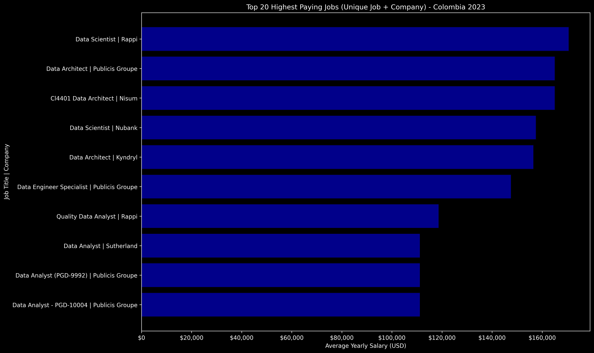
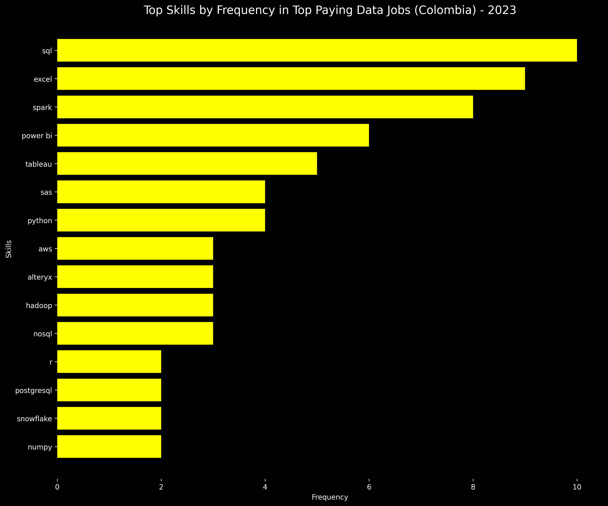
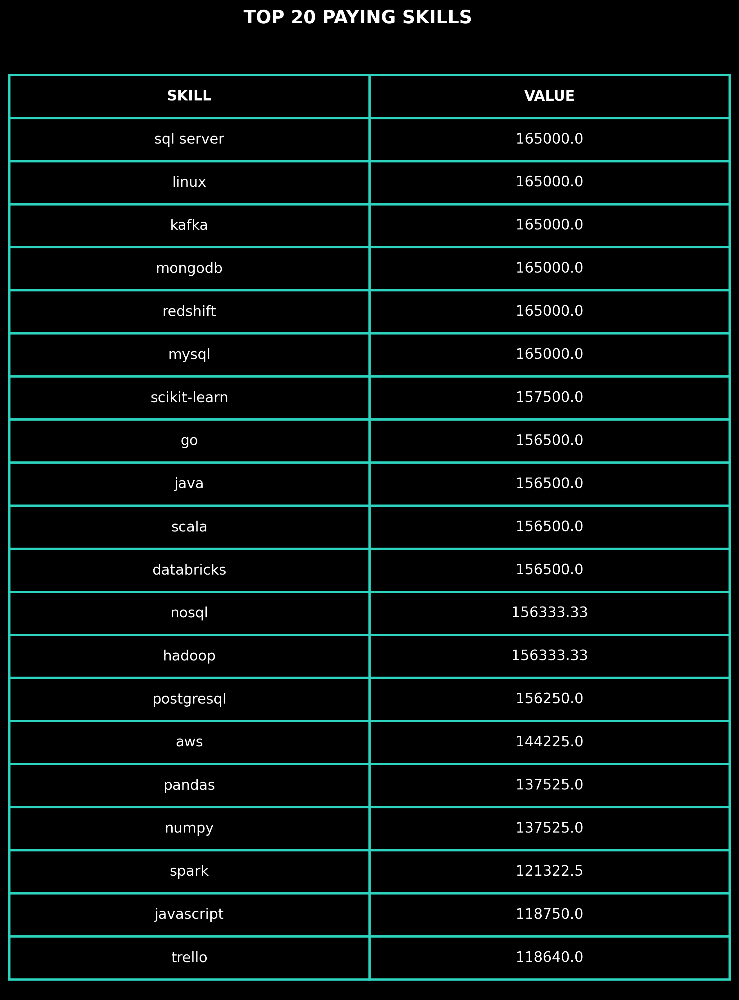
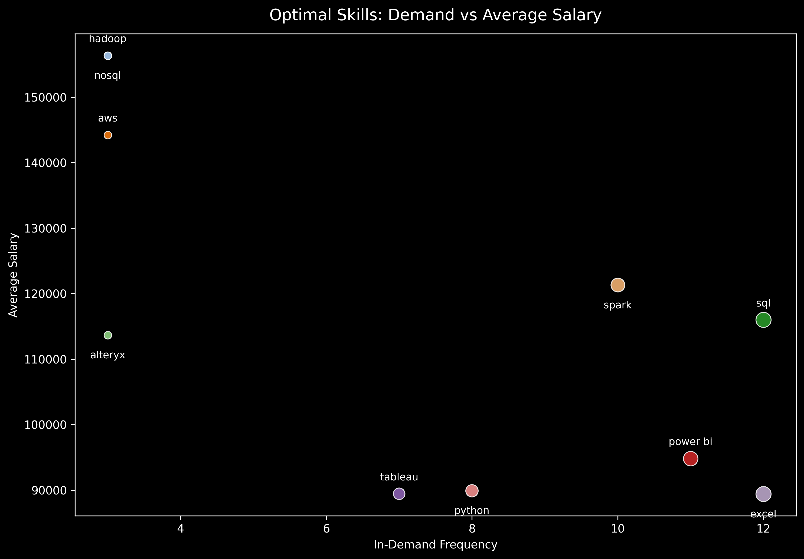

# <p align="center"> OPTIMAL SKILLS TO LEARN TO BECOME A DATA ANALYST/SCIENTIST IN COLOMBIA - 2023 </p>
## 🔷 Introduction 🐍🗄️
🔍 Exploring the data job market in 2023. This project analyzes data analyst and data science roles, focusing on 💰 top-paying jobs, 🔥 in-demand skills, and 📊 the relationship between salary and market demand. It also applies SQL techniques to clean, query, and analyze job market data.

The results of this analysis will serve as a baseline for a future project comparing job roles and skill requirements in 2025, enabling an evaluation of how the data job market evolves over time in Colombia.
### SQL Queries
Check them here: [query_results](./query_results/)
## 🔷 Background and Motivation 🎯
This project was driven by a personal interest in understanding the data analytics job market and identifying the skills required to become a data analyst or data scientist. The primary goal is to analyze job market data to determine which technical and analytical abilities are most valuable, allowing for a structured learning roadmap and practical skill development.

The analysis focuses on the Colombian job market as a starting point, providing insights into local demand before extending future research to international markets, particularly Germany. Additionally, this project serves as an opportunity to apply and strengthen SQL skills by querying, aggregating, and analyzing real-world job market data.

### Dataset

The dataset used in this project originates from a SQL-focused course and contains information on job titles, salaries, locations, and required skills for data-related roles. This dataset provides a foundation for exploring salary trends and skill demand in the Colombian data job market.

### Research Questions

The following questions were explored using SQL queries:

1. What are the top-paying data analyst and data scientist jobs in Colombia?

2. What skills are required for the top-paying data analyst and data scientist roles?

3. Which skills are most in demand across all data analyst and data scientist job postings in Colombia?

4. Which skills are associated with the highest average salaries (based on jobs that mention those skills)?

5. What are the most optimal skills to learn, considering both frequency (appearing more than twice) and average salary?

## 🔷 Tools Used ⚙️
● **SQL** for data extraction, aggregation, and analytical querying.

● **PostgreSQL** as the relational database system for storing and querying job postings.

● **Visual Studio** Code as the integrated development environment for database interaction and scripting.

● **Git** and **GitHub** for version control, reproducibility, and project documentation.

## 🔷 Analysis 🛠️
For each research question, SQL queries were developed to extract and aggregate relevant information from the dataset. The query results were exported as CSV files and processed in Python, where pandas were used for data cleaning and transformation, and matplotlib was used to generate tables and visualizations for analysis and interpretation.

[<u>*(Get to the Python files here)*</u>](./python_code_graphs)

[<u>*(Get to the query results here)*</u>](./query_results/)

Here is what I got:


### 1. Top Paying Data Analyst and Scientist Jobs
This analysis uses SQL to identify the top 10 highest-paying Data Analyst and Data Scientist roles in Colombia. The goal is to better understand salary levels in the market and get a clearer idea of which roles and companies tend to offer the best compensation.

```sql
SELECT
    jpf.job_title,
    jpf.salary_year_avg,
    COALESCE(cd.name, 'Company_No_Specified') AS company_name
FROM
    job_postings_fact jpf
LEFT JOIN company_dim cd ON jpf.company_id = cd.company_id
WHERE
    jpf.salary_year_avg IS NOT NULL
    AND jpf.job_location LIKE '%Colombia%'
    AND jpf.job_title_short IN ('Data Analyst','Data Scientist')
ORDER BY
    jpf.salary_year_avg DESC
LIMIT 20;
```

The query joins job postings with company information, filters for data analyst and scientist roles in Colombia with available salary data, and sorts by annual salary in descending order. It extracts the job title, salary, and company name for the top 20 paying positions (only the top 10 are shown for visibility reasons), providing a clear ranking of premium data roles in the Colombian market.



The graph visualizes the top 10 highest-paying positions, showing salary ranges from $170,575 (Data Scientist at Rappi) down to $118,640 (Quality Data Analyst at Rappi). Rappi, Publicis Groupe, Nisum, Nubank, and Kyndryl emerge as the top employers offering the highest salaries in Colombia (2023), with Data Scientists and Architects commanding premium compensation ($156k-$171k), while Data Analysts range from $79k-$118k. All positions are full-time roles primarily located in Bogotá.
### 2. Skills for Top Paying Jobs
Identifying the skills required for top-paying positions is essential for career development and skill prioritization. This analysis examines which technical and analytical competencies are most prevalent among the highest-compensated data roles in Colombia. By understanding the skill patterns in premium positions, professionals can focus their learning efforts on the competencies that lead to the best career outcomes.

```sql
WITH top_jobs AS (
    SELECT
        jpf.job_id,
        jpf.job_title,
        jpf.job_location,
        jpf.salary_year_avg,
        COALESCE(cd.name, 'Company_No_Specified') AS company_name
    FROM job_postings_fact jpf
    LEFT JOIN company_dim cd ON jpf.company_id = cd.company_id

    WHERE
        jpf.salary_year_avg IS NOT NULL
        AND jpf.job_location LIKE '%Colombia%'
        AND jpf.job_title_short IN ('Data Analyst', 'Data Scientist')
    ORDER BY jpf.salary_year_avg DESC
    LIMIT 20
)
SELECT
    COUNT(sd.skills) AS frequency,
    sd.skills                        
FROM top_jobs tp
INNER JOIN skills_job_dim sjd
    ON tp.job_id = sjd.job_id
INNER JOIN skills_dim sd ON sjd.skill_id = sd.skill_id
GROUP BY sd.skills
ORDER BY frequency DESC;
```
The query uses a CTE to extract the top 20 highest-paying data analyst and scientist jobs in Colombia, then joins this dataset with skills and job-skills dimensions to count skill frequency. It aggregates the data to show which skills appear most often across these premium positions, ranked by occurrence, giving insight into the technical competencies demanded by top employers.



The graph reveals that **SQL is the dominant skill in top-paying positions (10 occurrences)**, followed by Excel (9), and Spark (8), indicating that database management and big data processing are critical for commanding premium salaries. Business intelligence tools like Power BI (6) and Tableau (5), along with programming languages Python (4) and SAS (4), round out the top competencies. This skill distribution shows that data professionals seeking high-paying roles in Colombia need a solid foundation in SQL and modern analytics platforms.


### 3. In-demand Skills for Data Analysts and Scientists
While the top-paying positions reveal premium skill requirements, analyzing all data analyst and scientist job postings provides a broader market perspective. This analysis compares the in-demand skills across the entire Colombian job market for both roles, revealing whether salary-driving skills align with market-wide demand. By separating analysts and scientists, we can identify universal competencies versus role-specific specializations that define each career path.

```sql
SELECT
    sd.skills, 
    COUNT(sjd.job_id) AS skill_in_demand
FROM
    job_postings_fact jpf 
INNER JOIN skills_job_dim sjd ON jpf.job_id = sjd.job_id 
INNER JOIN skills_dim sd ON sjd.skill_id = sd.skill_id
WHERE
    jpf.job_title_short = 'Data Analyst'
    AND jpf.job_location LIKE '%Colombia%'
GROUP BY
    sd.skills
ORDER BY
    skill_in_demand DESC 
LIMIT 10;  
```

```sql
SELECT
    sd.skills, 
    COUNT(sjd.job_id) AS skill_in_demand
FROM
    job_postings_fact jpf 
INNER JOIN skills_job_dim sjd ON jpf.job_id = sjd.job_id 
INNER JOIN skills_dim sd ON sjd.skill_id = sd.skill_id
WHERE
    jpf.job_title_short = 'Data Scientist'
    AND jpf.job_location LIKE '%Colombia%'
GROUP BY
    sd.skills
ORDER BY
    skill_in_demand DESC 
LIMIT 10;  
```

Two parallel queries filter all data analyst and scientist job postings in Colombia by role type, then count the frequency of each skill across all positions (not limited to top 20). This approach reveals the broader market demand for skills, showing which competencies are truly essential for each role across the entire job market, enabling comparison between what top employers want versus what the broader market demands.


The analysis confirms that SQL remains essential for both roles (715 for analysts, 502 for scientists), validating it as a universal foundation skill. However, role-specific divergence emerges: Data Analysts prioritize Excel (550), Power BI (387), and Tableau (348) for business intelligence, while Data Scientists emphasize Python (566), R (329), and Spark (176) for advanced analytics and machine learning. Both roles value Python, Power BI, and Tableau, but the data proves that analysts focus on traditional BI tools while scientists require programming and big data expertise—confirming distinct career trajectories within the Colombian market.

### 4. Skills Based on Salary
Understanding which skills correlate with higher salaries is crucial for career planning, but it's important to note that no single skill guarantees a high-paying position. This analysis identifies the skills associated with the highest average salaries in Colombia's data job market. Professionals seeking premium compensation must develop a comprehensive skill set that combines multiple competencies—database expertise, programming languages, cloud platforms, and analytical tools working together to unlock high-paying opportunities.

```sql
WITH colombia_information AS (
    SELECT
        job_id,                                
        job_title_short,                    
        job_location,                          
        salary_year_avg                       
    FROM
        job_postings_fact
    WHERE
        job_location LIKE '%Colombia%'         
        AND salary_year_avg IS NOT NULL        
        AND job_title_short IN ('Data Analyst','Data Scientist')
),
information_filter AS (
    SELECT 
        sd.skills AS skill,     
        AVG(ci.salary_year_avg) AS avg_salary_skill
    FROM colombia_information ci
    INNER JOIN skills_job_dim sjd ON ci.job_id = sjd.job_id         
    INNER JOIN skills_dim sd ON sjd.skill_id = sd.skill_id      
    GROUP BY
        sd.skills                         
)
SELECT
    infil.skill,                   
    ROUND(infil.avg_salary_skill, 2)       
FROM
    information_filter infil
ORDER BY
    infil.avg_salary_skill DESC 
LIMIT 30; 
```

The query filters all data analyst and scientist jobs in Colombia with salary data, then joins with skills information to calculate the average salary for each skill across all positions where it appears. Skills are ranked by average compensation, providing a salary-weighted perspective of technical competencies. The results highlight which skills are associated with the best-paying roles, though success requires mastering multiple skills in combination.



The top 20 highest-paying skills range from SQL Server and specialized databases ($165,000 avg) down to Power BI ($94,817 avg), with database technologies, cloud platforms (AWS, Redshift), and big data tools (Hadoop, Spark) commanding premium compensation. However, this ranking emphasizes skill value in isolation—real high-paying positions require combining multiple skills: SQL + Spark + AWS, or SQL Server + NoSQL + Kafka. Professionals should view this as a guide to which skills enhance earning potential when integrated into a broader technical toolkit rather than focusing on individual high-paying skills.

### 5. Most Optimal Skills to Learn

Identifying the most optimal skills to learn requires balancing salary potential with market demand—a skill may pay exceptionally well but offer few opportunities, or appear frequently but not command premium compensation. This final analysis filters for skills appearing in at least 3 job postings (ensuring viable market demand) while ranking by average salary, revealing the practical skills that maximize both earning potential and employment opportunities. This represents the ultimate guide for structuring a learning roadmap to land high-paying data roles in Colombia.

```SQL
WITH skills_demand AS (
    SELECT
        sd.skill_id AS skill_id,     
        sd.skills AS skills,                
        COUNT(sjd.job_id) AS skill_in_demand     
    FROM
        job_postings_fact jpf
    INNER JOIN skills_job_dim sjd ON jpf.job_id = sjd.job_id            
    INNER JOIN skills_dim sd ON sjd.skill_id = sd.skill_id         
    WHERE
        jpf.job_title_short IN ('Data Analyst','Data Scientist')
        AND jpf.job_location LIKE '%Colombia%' 
        AND jpf.salary_year_avg IS NOT NULL     
    GROUP BY
        sd.skill_id                          
),

average_salary AS (
    WITH colombia_information AS (
        SELECT
            job_id,
            job_title_short,
            job_location,
            salary_year_avg
        FROM
            job_postings_fact
        WHERE
            job_location LIKE '%Colombia%'
            AND salary_year_avg IS NOT NULL
            AND job_title_short IN ('Data Analyst','Data Scientist')
    ),
    information_filter AS (
        SELECT 
            sd.skill_id AS skill_id,      
            sd.skills AS skill,             
            AVG(ci.salary_year_avg) AS avg_salary_skill
        FROM colombia_information ci
        INNER JOIN skills_job_dim sjd ON ci.job_id = sjd.job_id        
        INNER JOIN skills_dim sd ON sjd.skill_id = sd.skill_id      
        GROUP BY
            sd.skill_id 
    )
    SELECT
        infil.skill AS skill,
        infil.skill_id AS skill_id,
        ROUND(infil.avg_salary_skill, 2) AS avg_salary
    FROM
        information_filter infil
)
SELECT 
    skd.skills AS skill,                      
    skd.skill_in_demand AS in_demand_skill,     
    avsa.avg_salary AS avg_salary                
FROM
    skills_demand skd
INNER JOIN average_salary avsa ON skd.skill_id = avsa.skill_id            
WHERE
    skd.skill_in_demand > 2                 
ORDER BY
    avg_salary DESC,                        
    in_demand_skill DESC                     
LIMIT 10;                                     
```

The query combines two CTEs: one calculating skill frequency across all data analyst and scientist jobs in Colombia, and another computing average salary per skill. Both are joined to filter for skills with 3+ occurrences, then ranked by salary and demand. This approach ensures only skills with meaningful market presence are included, balancing the trade-off between high compensation and actual job availability to identify genuinely optimal learning targets.



The results reveal that Hadoop and NoSQL top the list at $156,333 average salary with the highest earning potential, followed by AWS ($144,225) and Spark ($121,322). Notably, SQL, Power BI, Python, Tableau, and Excel—the core competencies for data analysts—rank within the top 10 despite not commanding the absolute highest individual salaries, with SQL ($116,001), Spark ($121,322), and Python ($89,922) appearing most frequently (8-12 occurrences). This proves that the foundation skills are both high-paying and highly demanded, making them the smartest investments for aspiring data professionals, while advanced skills like Hadoop and NoSQL serve as career accelerators for those seeking specialist roles and maximum compensation.

This was done with the intentation
## 🔷 What I take 📖
Throughout this project, I significantly strengthened my SQL skill set by applying advanced querying techniques and analytical methods to real-world job market data. Understanding the SQL syntax alongside working with a real project made me understand important concepts and how to leverage data to answer meaningful business questions.

Based on the comprehensive analysis completed, I've validated that my current learning path is strategically aligned with the Colombian data job market. My focus on mastering **SQL**, **Python**, **Power BI**, **Excel**, and progressively building competency in these core skills matches exactly what the market demands—these skills appear in both top-paying positions and across 90% of all data analyst and scientist job postings. The analysis confirms that this foundation provides both high employability and strong salary potential (**$89k-$116k average**), with clear pathways to advance into specialized roles commanding premium compensation.

Additionally, AI tools (like **ChatGPT** and **GitHub Copilot**) proved invaluable in organizing and interpreting the analysis results, helping me structure complex data insights into actionable conclusions. **GitHub** has been essential for version control and project reproducibility, enabling me to track changes and maintain a clean project history throughout the analysis workflow.

The key take aways:

● SQL is non-negotiable for aspiring data professionals in Colombia.

● Building a comprehensive skill set is more valuable than specializing in one high-paying skill.

● My learning roadmap (SQL → Python → Power BI/Excel) directly reflects market demands and salary progression.

● Data-driven decision making, combined with modern development tools, accelerates both technical and analytical skill development.


## 🔷 Conclusions 📝
### Closing takes
- **Combined Approach:** This project successfully merged Python for data modeling, SQL for complex query writing, and AI tools for analysis acceleration to extract actionable insights from the Colombian data job market.
- **AI Efficiency:** AI tools helped organize complex analysis ideas, polish Python code, and refine SQL queries, freeing me to focus on what truly matters: interpreting the analysis and drawing meaningful conclusions rather than routine formatting and documentation tasks.
- **SQL as Foundation:** I demonstrated that SQL fundamentals are the gateway skill in the data job market—every insight traced back to strong query construction, debugging complex joins, and validating results.
- **Project Goal Achieved:** The primary objective was mastering SQL fundamentals through applied, real-world problem-solving rather than isolated learning.

